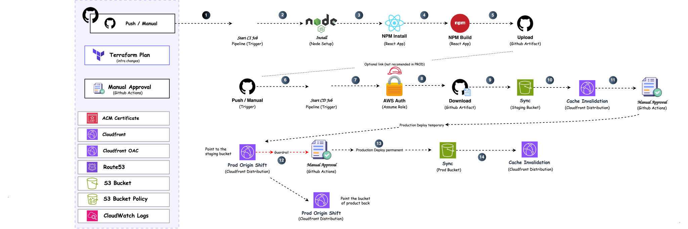

# CloudFront Blue-Green Deployment Platform

Production-grade AWS CloudFront infrastructure with continuous deployment capabilities using blue-green deployment strategy.

## Architecture



## Tech Stack

- **Infrastructure**: Terraform (modular design)
- **Cloud Provider**: AWS (CloudFront, S3, Route53, ACM, CloudWatch)
- **CI/CD**: GitHub Actions (OIDC authentication)
- **Frontend**: React + Vite
- **Deployment**: Blue-Green with CloudFront Continuous Deployment Policy

## Key Features

### Infrastructure as Code
- Modular Terraform modules for reusable components
- Multi-environment support (dev/production)
- State management with S3 backend and DynamoDB locking

### Continuous Deployment
- Blue-green deployments with CloudFront Continuous Deployment Policy
- Staging distribution for preview testing
- Automated production promotion via GitHub Actions

### Security & Observability
- Origin Access Control (OAC) for S3 buckets
- SSL/TLS certificates via ACM with Route53 DNS validation
- CloudWatch Logs integration for access logs
- Private S3 buckets with least-privilege policies

### CI/CD Pipeline
- Automated builds on push to `main`/`master`
- Artifact-based deployment workflow
- Manual approval gates for production
- Cache invalidation automation

## Project Structure

```
terraform/
├── modules/              # Reusable Terraform modules
│   ├── cloudfront/       # CloudFront with CD policy support
│   ├── s3-bucket/        # S3 bucket module
│   ├── route53/          # DNS configuration
│   └── ...
├── environments/
│   ├── production/       # Production environment
│   └── dev/              # Development environment
└── github-oidc/          # OIDC provider for GitHub Actions
```

## Quick Start

### Prerequisites
- Terraform >= 1.3.0
- AWS CLI configured
- GitHub repository with OIDC setup

### Deploy

```bash
cd terraform/environments/production
terraform init
terraform plan
terraform apply
```
